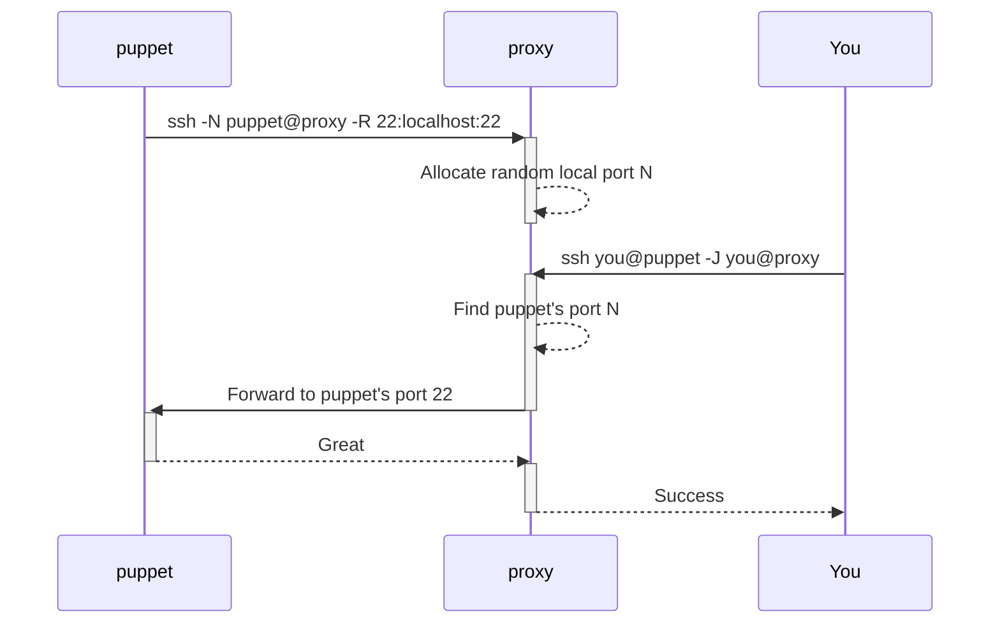

# gosshpuppet

gosshpuppet is a limited SSH server base on [github.com/gliderlabs/ssh](https://github.com/gliderlabs/ssh).

It acts as a jump host, interconnecting SSH clients: admins and puppets (controlled hosts).

Main goal here is to access a remote puppet in a secure way even if it's behind a NAT or has a dynamic IP and/or if a VPN is not an option.

Features:

- Only public key authentication is allowed;
- No access to shell/exec on the proxy side for both admins and puppets;
- A puppet can only request a reverse tunnels (-R) to the predefined ports;
- An admin can only connect to the predefined ports on the puppets;



---

## Prepare

### 1. Host/proxy private key

Generate a key pair for the server:

```bash
ssh-keygen -t ed25519 -f ./host
```

### 2. Access config

Write `access.yaml` with the following structure:

```yaml
admins:
  # Your user name
  admin:
    # Public keys for both proxy and puppet side 
    - ssh-ed25519 AAAAC3NzaC1lZDI1NTE5AAAAIBwDW1pJvt0ID4s8cMFv5gCbGs7fO8Mc3smf3hd8umwG admin@localhost

# Puppets names and public keys
puppets:
- regexp: ^puppet1$
  keys:
    - ssh-ed25519 AAAAC3NzaC1lZDI1NTE5AAAAIPzp5Lm/8IQ3gK/Owl84Gh/XUGOtE+vStFXB6rCmaFdK puppet1@localhost

# Allowed puppet ports to forward
services:
  22: ssh
```

### 3. Start the proxy

```bash
./gosshpuppet --private ./host
```

---

## Connect

### 1. Connect puppet

Connect as `puppet1` (should be lowercased for a name matching), requesting a reverse tunnel on service port `22` to the puppet's own port `1222`:

```bash
ssh -N puppet1@gosshpuppet -p 2222 -R 22:localhost:1222
```

### 2. Connect admin

Connect to the `puppet1` service port `22` as `foobar`, jumping through the proxy at `gosshpuppet:2222` as `admin`.

```sh
> ssh foobar@puppet1 -J admin@gosshpuppet:2222
# or copy a file
> scp -J admin@gosshpuppet:2222 foobar@puppet1:/path/to/file ./file
```

List puppets connected to the proxy:

```bash
> ssh admin@gosshpuppet -p 2222 ls
PUPPET   PORTS
puppet1  ssh=22
```
